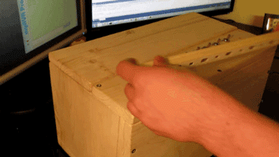

# RS255_Berlekamp_Decoder

RS 是一种纠错码：


## 使用方法

``` shell
cd berlekamp_tools
swig -c++ -python RS255.i
python3.6 setup.py install
cd ../berlekamp_decode_simulation
python3.6 Berlekamp_decode_simulation.py
```

成功运行会得到下面曲线:


