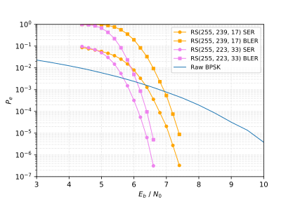

# RS255_Berlekamp_Decoder

## 新的改动

- 加入了 欧几里得译码算法的 Python 和 C++ 接口，函数名为 euclidean\_decoder，参数和 berlekamp\_decoder 的参数保持一致
- 未经过随机化测试，不保证正确性和 bugfree
- Berlekamp 算法和 Euclidean 可能会在有时间的时候复习一下
- 算法待优化，考虑 FFT
- 代码待优化
- 文档待完成

## 用到的软件清单
- Ubuntu 16.04
- C/C++
- Python 3.6
- SWIG 3.0.8

## 架构
- C/C++ 完成有限域的构造，有限域上的多项式的构造，Berlekamp译码算法的实现
- Python 3.6 实现 BPSK 调制解调，AWGN 信道模拟
- SWIG 3.0.8 用于将译码算法的 C/C++ 函数封装成 Python 的接口

## 使用方法

``` shell
cd berlekamp_tools
swig -c++ -python RS255.i
python3.6 setup.py install
cd ../berlekamp_decode_simulation
python3.6 Berlekamp_decode_simulation.py
```

成功运行会得到下面曲线:




## 目前存在的问题

- 高信噪比的情况下仿真点数不足，导致结果可能不够精确
- 有限域及其上的多项式的运算函数没有经过优化，因此运行速度较慢

## 未来的改进

- 采用 CUDA 完成有限域上的多项式运算的并行化
- 加入得到仿真时间的功能
