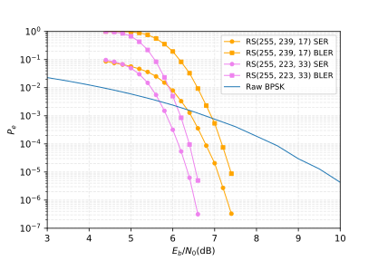

# RS255_Berlekamp_Decoder

RS (Reed-Solomon) 编码是一种基于代数的纠错码 (RS (Reed-Solomon) code is a kind of Error Correcting Code(ECC) based on algebra)，其广泛应用于卫星通信，存储等领域。

它离我们的生活并不远，我们喜闻乐见的二维码，就是通过 RS 编解码实现纠错的（用手挡住一部分二维码，或者在光线很暗的环境下，依然可以正确的扫描其所包含的信息）。

下面的图就是一个纠错的过程：


图中虽然人为地（信道噪声）改变了盒子的状态（发送信号），但是机械臂依然（解码器）有能力将状态还原。

[Berlekamp 算法](https://jimyma.github.io/2018/07/09/Berlekamp_algorithm/) 是一种对 RS 编码的纠错算法 (Berlekamp Algorithm is a method to correcting error for RS code.)

一个解码的过程的例子：
``` 
source code: [0, 0, 0, 0, 0, 0, 0]
+
noise: [0.1, 0.2, 0.05, 0.6, 0.1, 0.05, 0.3]
||
judgement: [0, 0, 0, 1, 0, 0, 0]
|
decode
|
v
after decode: [0, 0, 0, 0, 0, 0, 0]
```

## 安装 (Install)
``` shell
git clone https://github.com/JimyMa/RS255_Berlekamp_Decoder --recursive
pip -r requirements.txt
python setup.py develop --user
```

## 使用方法 (Usage)
``` shell
cd examples
# end-to-end
python Berlekamp_decode_simulation.py
# step-by-step
jupyter-notebook Berlekamp_decode_simulation.ipynb
```
程序运行成功将输出如下曲线 (Outputs when the program is done):


